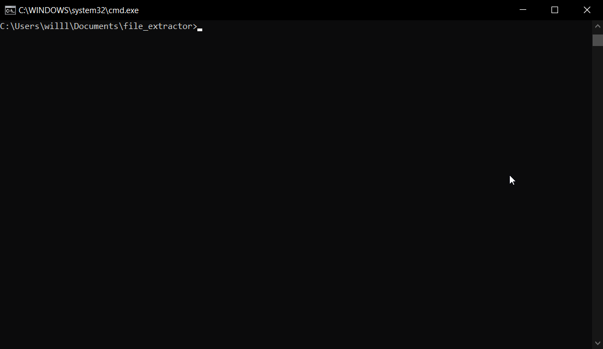

# file_extractor
Command line interface for searching and extracting files out of large directories.

## Usage

### copy
This argument will copy all the interested files from the source directory to the final directory without maintaining the original file hierarchy.

### move
This argument will move (cut) all the interested files from the source directory to the final directory without maintaining the original file hierarchy.
